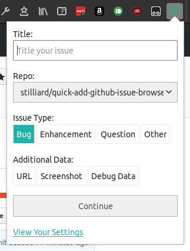

# Browser extension to quickly report issues to GitHub **and Gitea**

**Setup required:** copy `popup/config.js.example` to `popup/config.js` and set a random secret (used to encrypt settings in `chrome.storage.local`). Do **not** commit this file.

Supports Chrome & Firefox.

- [Chrome Extension](https://chrome.google.com/webstore/detail/quick-add-issue-to-github/mgamfhobfmlghohfjdiecjhddoigenkk)
- [Firefox Addon](https://addons.mozilla.org/en-GB/firefox/addon/quick-add-issue-to-github/)

Features:
- **Destinations:** GitHub (existing) and Gitea (new)
- **Repo selection:**
  - GitHub: user repos + optional org repos; org projects (projects V2) when org is set
  - Gitea: user repos + optional org repos, merged/deduped and grouped by owner
- **Labels:**
  - GitHub: issue type labels (bug/enhancement) via URL params
  - Gitea: label picker modal with search and per-repo caching; applies label IDs via API
- **Issue templates:** bug/enhancement body scaffolds
- **Extras:** optional URL, debug info, and screenshot download placeholder
- **Success flow:**
  - GitHub: opens the prefilled issue page in a new tab
  - Gitea: creates the issue via API and shows a success screen with a copyable link (no auto-open tab)

------

A few ideas / next steps:
- Support repo-level projects (GitHub) and Gitea projects/milestones (currently not implemented)
- Better OAuth flow (today uses PAT/token)
- Screenshot hosting/auto-attach instead of manual download/drag
- Allow custom issue templates per destination

-------

Local dev:

- Install packages with `npm install`
- Build bundled JS: `npm run build` (or `npm run watch`)
- Tests: `npm test` (Vitest)
- Package zip: `make` (requires `web-ext` installed globally)
- Load unpacked for Chrome: `chrome://extensions` → “Load unpacked” → repo root
- Load temporary add-on for Firefox: `about:debugging` → “This Firefox” → “Load Temporary Add-on” → choose `manifest.json`

Gitea usage notes:
- Settings: choose destination **Gitea**, set **Base URL**, **Token**, and optionally **Org**. Host permissions are broad (`*://*/*`) so self-hosted Gitea works without manifest changes.
- Repo dropdown loads user + org repos, merged/deduped.
- “Choose labels…” opens a Bootstrap modal to search/select labels (IDs are sent to Gitea).
- Submit creates the issue via API; success screen shows the new issue link and a “Copy link” button (no tab open).

-------

Current icon from: https://octicons.github.com/icon/report/

**[Contributions welcome](https://github.com/stilliard/quick-add-github-issue-browser-extension) :)**
