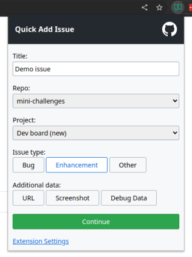

# Browser extension to quickly report issues to GitHub

**Make sure you have setup your popup/config.js first!** - copy the popup/config.js.example to popup/config.js and set a secret for it to work.

Icon from: https://octicons.github.com/icon/report/

Supports Chrome & Firefox.

TODO:
- submit to chrome webstore
- submit to firefox addons site
